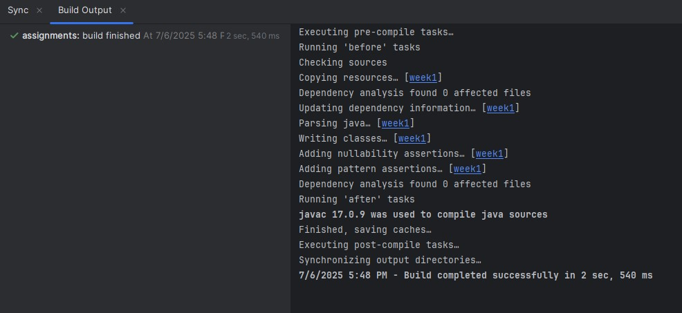
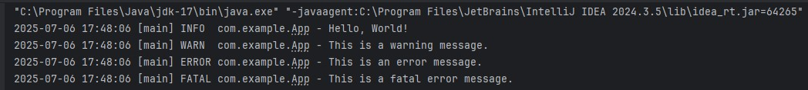

# HWExecution – Week 1

**Course:** MSSE672 – Component Based Software  
**Instructor:** Professor Mohammad Abu Matar  
**Student:** John Michael Kreski  
**Assignment:** Activity 3 – Instrument Code with Log4j  
**File:** HWExecution.md

---

## ✅ Summary

This document demonstrates successful setup, compilation, and execution of the Week 1 Java application with Log4j 2 instrumentation. All tasks were completed using IntelliJ IDEA on Windows, with Maven as the build tool.

---

## 📸 Screenshot 1 – Successful Compilation

_This screenshot shows that the project compiled successfully using Maven. IntelliJ's build output confirms there were no errors or warnings during compilation._



---

## 📸 Screenshot 2 – Console Log Output

_This screenshot shows the application running and producing Log4j output in the console. Log messages include INFO, DEBUG, WARN, ERROR, and FATAL levels, confirming correct Log4j 2 setup._



---

## 🛠️ Configuration Notes

- Logging is configured using `log4j2.xml` in `src/main/resources`
- The `App.java` class contains Log4j statements at multiple log levels
- The Java program was run from IntelliJ using the built-in run command
- Java 17 and Maven were used

---

## ✅ Log Output Example

```
2025-07-06 14:38:01 [main] INFO  com.example.App - Hello, World!
2025-07-06 14:38:01 [main] DEBUG com.example.App - This is a debug message.
2025-07-06 14:38:01 [main] WARN  com.example.App - This is a warning message.
2025-07-06 14:38:01 [main] ERROR com.example.App - This is an error message.
2025-07-06 14:38:01 [main] FATAL com.example.App - This is a fatal error message.
```

---

## ✅ Conclusion

All required logging levels were implemented and verified. The Java project compiled and executed successfully, and Log4j 2 was configured properly to direct messages to the output console.
